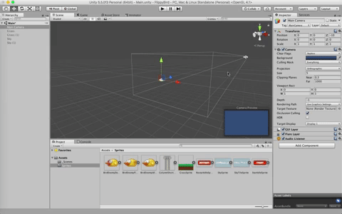
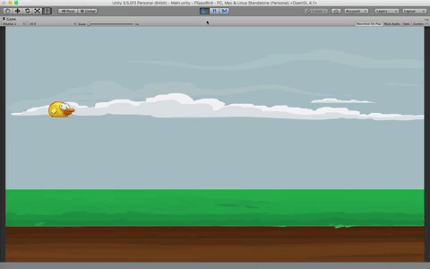

# Flappy Bird


Welcome back! In this assignment, we'll be designing our first full-fledged game, a clone of the cult classic, FlappyBird.

To start, make a new Unity Project (in 2D) and open it.

## Getting Started
### Setting Up Our Assets Folder
One thing we didn't quite cover in the last short assignment is best practices for organizing your Assets folder (since we didn't really have that many assets). As the projects get bigger, it helps a lot to keep everything nicely organized. Here's what my directory looked like at the end of the project:


I recommend doing something similar to keep all your assets in easily searchable spots. Note that "\_Scenes" has an underscore in it by convention, so that our scenes are always ordered first.

### Importing Assets
Let's start by downloading some assets from the Unity Asset Store. Navigate to the Asset Store tab (probably next to your Scene and Game View tabs). If it doesn't work on the first go, try flipping to another tab and back again.

Once there, search for "2D Sprites Pack". It should be the first result, free, and made by Unity Technologies. Hit the download button, and when the window pops up on your screen to import the assets, select only the eight we'll need for the assignment:

- BirdEnemyDeathSprite
- BirdEnemyFlapSprite
- BirdEnemyIdleSprite
- ColumnShortSprite
- GrassSprite
- RestartIdleSprite
- SkyTileSprite
- StartIdleSprite

Hit import. Unity should automatically place these sprites in the `Sprites` folder that you created in the last step.

### A Few Notes On 2D
This is the first time we're working in 2D, but don't worry! This should in theory simplify things by removing a whole dimension, and it does.

The only thing to really watch out for is that when creating any physics components, we want to make sure we select them from the "Physics 2D", as the normal 3D versions might cause some problems that we don't want.

Also note that our camera works a little differently here. If you look in the camera's inspector, under the Camera component, you can see that the projection field is labeled "Orthographic". In the gif below, you can sort of see the difference. Essentially, an orthographic camera sees objects at a seemingly equal distance regardless of their distance from the camera itself (i.e. a box 300 pixels away will look the same size as a box 3 million pixels away.) In 3D we are used to the perspective camera, which is also shown in the gif, and makes things looks smaller as they get further and further away, as they do in our 3D real world.



## Background
Our background is going to have two parts, the sky and the ground. From the `Sprites` folder, drag the GrassSprite so mostly the grass is in the camera's field of view, and the SkyTileSprite so it covers the rest of the space. You can drag these out quite a bit, and then you can duplicate them with `command+d` on Mac or `control+d` on Windows and drag them out further. Mine looked something like this:


## The Player
FlappyBird is nothing if we don't have a player to lead us on our epic expedition through the never-ending obstacles. The provided bird isn't quite as heroic as our beloved 8-bit hero...


...but we do get something close enough. Drag the `BirdEnemyIdleSprite` into the scene, near the top left corner. Change its name to "Player" in the hierarchy view.

He's facing the wrong way! Easy fix. In the inspector, under the "Sprite Renderer" component, check the box under "flip" next to "X".

The player is going to need to handle some basic physics too. What do we need to add? If you guessed `Rigidbody`, you're close. Click "Add Component", and then click "Physics 2D" > "Rigidbody 2D".

Press the play button to test.

Our poor bird never learned to fly! Let's fix that.

Create a new script called "PlayerController". Open it up for editing. Paste in the following code:

```csharp
using System.Collections;
using System.Collections.Generic;
using UnityEngine;

public class PlayerController : MonoBehaviour {

	public int jumpForce;

	private Rigidbody2D rb2d;

	void Start () {
		rb2d = gameObject.GetComponent<Rigidbody2D> ();
	}

	void Update () {
		if (Input.GetKeyDown (KeyCode.Space)) {
			rb2d.AddForce(new Vector2(0, jumpForce * 100));
		}
	}
}
```

What's going on here? We create a public int called jumpForce, which is some value that we'll set in the editor. We also have a Rigidbody2D component that we initialize to point to the Rigidbody2D on the player object. (Recall that this script is attached to the Player GameObject. The `gameObject.getComponent` call will therefore get the component of the specified type that is also attached to this player GameObject.)

In `Update()`, we are just listening for any time the user hits the spacebar. When this happens, we add an upward force of 100 times our jumpForce.

Save the script and return to the editor. When you get back there, we'll have to change two values: "Jump Force" and "Gravity Scale". The former is in our script and determines the force with which we jump up. The latter is in the Rigidbody2D and determines how much gravity will pull our player downwards.

Play around with these values a bit and test until you find something you like. I used Gravity Scale 2 and Jump Force 6, but you may find something you prefer. Once you're satisfied, you should be able to hop in place after hitting the play button.


